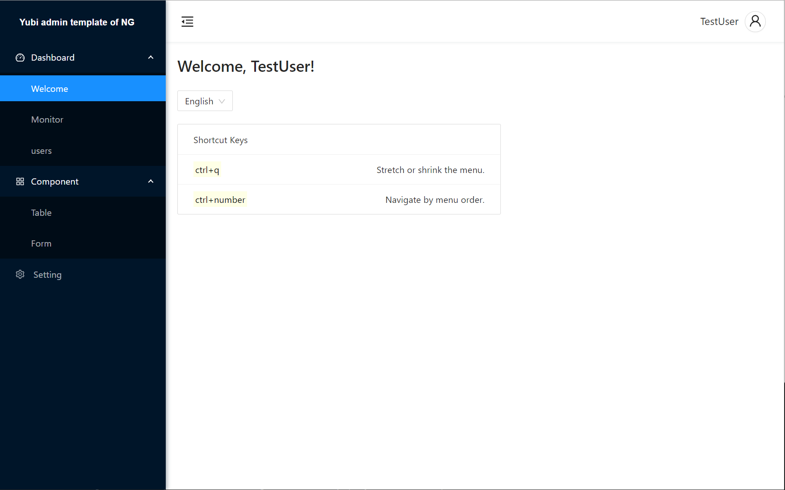

<html>
  <h1 align="center" style="text-align: center"> Yubi-angular-admin </h1>
  <h6  align="center" style="text-align: center"> 这是Angular11的通用后台模版解决方案，开箱即用，结构清晰。
    
（后两个仅仅针对本作者而言）
 
  </h6>
  <h6  align="center" style="text-align: center">由小萌新Yubi开发和维护。
    
（即，不断写BUG和制造更多的BUG）
 
  </h6>

  

    
      
    
    
      
    
    
      
    
    
      
    
  

</html>

---

[在线使用](https://yubi233.gitee.io/yubi-angular-admin)

### 特征
- **TypeScript**
- **合理的目录结构** <a style="color: grey; font-size: 14px;margin: 5px 0 0 -3px" href="./docs/"> 萌新自认为  → 介绍文档 </a>
- **国际化**<a style="color: grey; font-size: 14px;margin: 5px 0 0 -3px"  href="./docs/"> 萌新自创解决多语言方案  → 介绍文档</a>
- **状态管理工具**<a style="color: grey; font-size: 14px;margin: 5px 0 0 -3px"  href="./docs/"> 仿Vuex的状态管理工具  → 介绍文档</a>
- **路由守卫**<a style="color: grey; font-size: 14px;margin: 5px 0 0 -3px"  href="./docs/"> 鉴权  → 介绍</a>
- **利用请求拦截实现本地数据调试方案**<a style="color: grey; font-size: 14px;margin: 5px 0 0 -3px"  href="./docs/"> 就是Mock  → 介绍文档</a>
- **配置化封装antd表单**     

